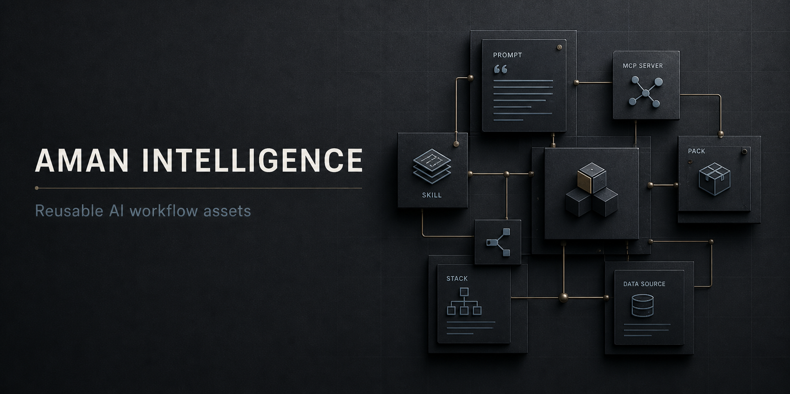

<div align="center">



# Aman Intelligence Asset Registry

**The official central catalog of reusable agent skills, system prompts, and MCP configurations.**

[](aman.json)
[](skills/)
[](prompts/)
[](https://github.com/amandeavor/Aman-Intelligence/actions/workflows/ci.yml)
[](https://github.com/amandeavor/Aman-CLI)

<p align="center">
  <a href="#overview">Overview</a> •
  <a href="#included-skills--prompts">Catalog</a> •
  <a href="#asset-specification">Structure</a> •
  <a href="#validation">Validation</a> •
  <a href="#contributing">Contributing</a>
</p>

</div>

---

## Overview

`Aman-Intelligence` is the official upstream content registry for [**Aman CLI**](https://github.com/amandeavor/Aman-CLI). It provides battle-tested, modular **Agent Skills**, **System Prompts**, and **Model Context Protocol (MCP)** assets that can be installed directly into local development environments and multi-agent IDE workflows.

---

## Included Skills & Prompts

```
skills/
├── frontend-design/             # High-contrast, production-grade UI architecture
├── design-taste-frontend/       # Anti-slop layout and visual balance guidelines
├── emil-design-eng/             # Micro-interactions, spring motion, and polish
├── audit-website/               # SEO, security, accessibility, and performance scanning
├── clone-website/               # Section-by-section reverse engineering & rebuild
├── ai-seo/                      # Generative engine (GEO / LLMO) search optimization
├── brandkit/                    # Art-directed visual systems and design decks
├── full-output-enforcement/     # Truncation prevention and unabridged code emission
├── grill-me/                    # Relentless design and architecture stress-testing
└── ... and more
```

---

## Asset Specification

Every asset in the registry follows strict canonical layout rules validated by CI:

### Skills (`skills/<skill-name>/`)
- **`SKILL.md`**: Main operational prompt with YAML frontmatter, tool requirements, and procedural guides.
- **`scripts/`** *(optional)*: Helper scripts executed by agents.
- **`references/`** *(optional)*: Reference documentation and type definitions.

### Prompts (`prompts/<prompt-name>/`)
- **`PROMPT.md`**: System and task prompts with clear parameters and instructions.

### MCP Configurations (`mcps/<mcp-name>/`)
- **`mcp.json`**: Server transport definitions (stdio/SSE/HTTP) and argument schemas.

---

## Usage with Aman CLI

Install any skill directly into your current workspace:

```bash
# Install specific skill from registry
aman install @aman-intelligence/frontend-design --local

# Install global development workflow pack
aman install @aman-intelligence/web-audit-stack --global
```

---

## Registry Validation

All assets in this repository are verified with automated integrity tests:

```bash
# 1. Clone repository
git clone https://github.com/amandeavor/Aman-Intelligence.git
cd Aman-Intelligence

# 2. Run registry integrity test
npm test
```

The validation script ensures:
- `aman.json` manifest is valid.
- Every skill has a non-empty, properly structured `SKILL.md`.
- Every prompt has a non-empty `PROMPT.md`.
- No API keys or secret credentials are committed.

---

## Community & Governance

- [Contributing Guide](CONTRIBUTING.md)
- [Security Policy](SECURITY.md)
- [Code of Conduct](CODE_OF_CONDUCT.md)
- [License Decision Issue](https://github.com/amandeavor/Aman-Intelligence/issues/5)

---

## License

See [Issue #5](https://github.com/amandeavor/Aman-Intelligence/issues/5) for repository license selection status.
